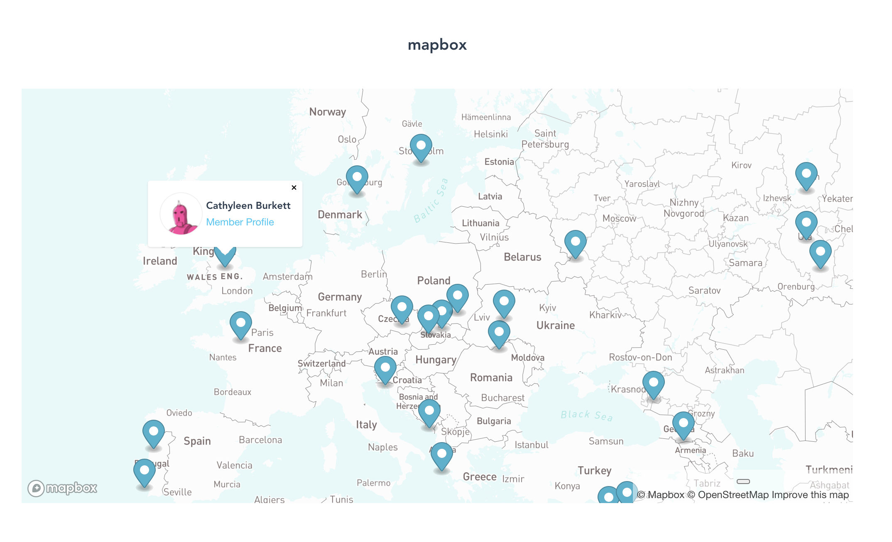

# Mapbox

Demo Vue app to play around with [mapbox](https://www.mapbox.com/).



## Project setup

Create an .env file in the root directory with the following entries:

```javascript
VUE_APP_MAPBOX_TOKEN=MAPBOX PUBLIC TOKEN
VUE_APP_MAPBOX_STYLE_URL=MAPBOX STYLE URL
```

## Available scripts

### Compiles and hot-reloads for development

```
yarn serve
```

### Compiles and minifies for production

```
yarn build
```

### Lints and fixes files

```
yarn lint
```

### Customize configuration

See [Configuration Reference](https://cli.vuejs.org/config/).
